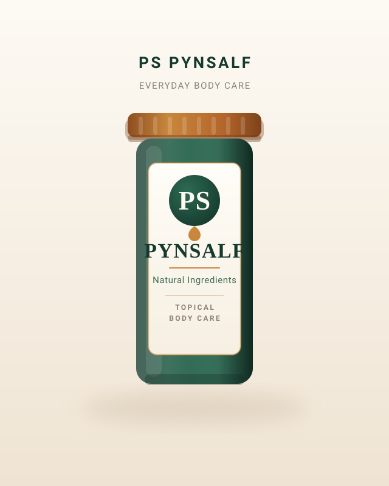

# PS PynSalf — content notes

The site is live at https://leesetzkorn-maker.github.io/pynsalf/
Every push to `main` republishes automatically via GitHub Actions.

## Brand

- Business / product name: **PS PynSalf** ("PS" = PynSalf, stated explicitly on the page)
- Logo mark: `assets/logo-mark.svg` (also used as the favicon artwork, see `assets/favicon.svg`)
- Jar artwork: `assets/product-pynsalf.svg` — labelled PS / PYNSALF / Natural Ingredients

## Still needed from the product owner

Nothing is blocking the site. These are the details to add when you have them:

| What | Where it goes | Current wording |
|---|---|---|
| Real product photo | hero | `assets/product-pynsalf.svg` jar artwork |
| Ingredients | About the Ointment | "Full ingredient and product information coming soon." |
| Price | About the Ointment | "Full product information coming soon." |
| Directions from the label | How To Use | "Directions will be added from the product label." |
| **Facebook page URL** | Contact section | avatar image only, no link yet |
| Business / trading hours | Contact section | not shown |

## Facebook

`assets/facebook-avatar.jpg` is the supplied profile photo, resized to 200x200.
The Contact section shows it beside "Facebook profile", but it is **not a link**
because the real page URL is unknown. Do not link it until the page URL is confirmed.
To make it clickable, add an `href` in
`index.html` on the `.contact-fb` span:

```html
<a class="contact-fb" href="https://facebook.com/your-page" target="_blank" rel="noopener">
```

## How to replace the product photo

Save your photo into `assets/` and update this one line in `index.html`:

```html

```

The hero frame **does not crop**. It is capped at 480px wide (540px on desktop) and
keeps whatever proportions the image has, so a vertical photo works best but any
orientation will display in full. Drop in a real photo and remove the
`width`/`height` attributes if the photo is not 640x800.

## Customer photos

Originals stay on your computer and are excluded from the live site by `.gitignore`:

- `before.jpg` / `after.jpg` → published as `assets/before-1.webp`, `assets/after-1.webp`
- `before 2.jpg` / `after 2.jpg` → published as `assets/before-2.webp`, `assets/after-2.webp`
- `review.jpg` → published as `assets/review.webp`

Each photo is also published at a second, smaller size so phones do not download the
large file (for example `assets/before-1-380w.webp` alongside `assets/before-1.webp`).
The markup uses `srcset`, so the browser picks the right one automatically.

**The customer photos are never cropped, filtered or resized with a forced aspect
ratio.** Please keep it that way — they are real people sharing real results. The
Before/After frames deliberately use plain `width: 100%; height: auto`.

To re-export after a change, resize to 760px wide (860px for the review) and save as
WebP, then regenerate the smaller variants.

## Wording

The copy stays deliberately careful: "soothing", "topical care", "designed for",
"everyday aches and discomfort". No cure claims, no certifications, no invented
testimonials or ratings. The customer's review appears as their own screenshot,
unedited. Add stronger wording only when you can support it.

## Run locally

No build step and no dependencies. Open `index.html`, or:

```bash
npx serve .
```

## Testing

There is no test runner in the repo, to keep it dependency-free. Before publishing,
check the site at 360px, 390px, 768px and 1280px wide:

- no sideways scrolling
- the four customer photos and the review screenshot show in full, uncropped
- the menu opens and closes on a phone
- the WhatsApp, phone and email buttons all work
- the floating WhatsApp button does not sit on top of any text

## Contact details

- WhatsApp: https://wa.me/27723973400 (shown as 072 397 3400)
  Prefilled message: "Hi, I'd like to know more about PS PynSalf."
- Phone: tel:+27723973400
- Email: Gustavsetzkorn99@fmail.com